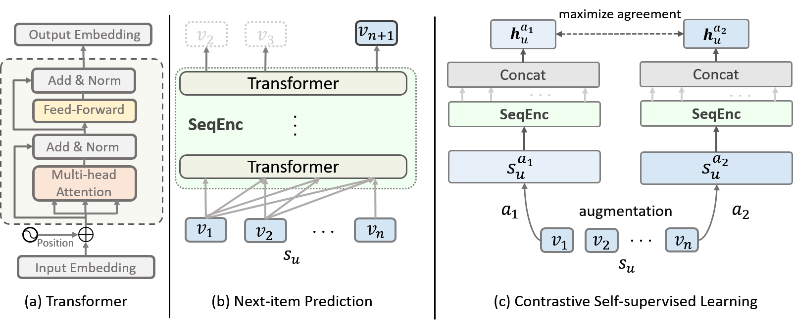

# Introduction
Contrastive Self-supervised Sequential Recommendation with Robust Augmentation (CoSeRec)

Source code for paper: [Contrastive Self-supervised Sequential Recommendation with Robust Augmentation](https://arxiv.org/pdf/2108.06479.pdf)

Model architecture:



Data Augmentations:


# Reference

Please cite our paper if you use this code.

```
@article{liu2021contrastive,
  title={Contrastive self-supervised sequential recommendation with robust augmentation},
  author={Liu, Zhiwei and Chen, Yongjun and Li, Jia and Yu, Philip S and McAuley, Julian and Xiong, Caiming},
  journal={arXiv preprint arXiv:2108.06479},
  year={2021}
}
```

# Implementation
## Requirements

Python >= 3.7  
Pytorch >= 1.2.0  
tqdm == 4.26.0

## Datasets

Four prepared datasets are included in `data` folder.

## Train Model

To train CoSeRec on `Sports_and_Outdoors` dataset, change to the `src` folder and run following command: 

```
bash sports.sh
```
You can train CoSeRec on Beauty or Yelp in a similar way.

The script will automatically train CoSeRec and save the best model found in validation set, and then evaluate on test set. You are expected to get following results after training:

```
'HIT@5': '0.0287', 'NDCG@5': '0.0194', 'HIT@10': '0.0437', 'NDCG@10': '0.0242', 'HIT@20': '0.0635', 'NDCG@20': '0.0292'
```


## Evaluate Model

You can directly evaluate a trained model on test set by running:

```
python main.py --data_name Sports_and_Outdoors --model_idx 0 --do_eval
```

We provide a model that trained on Sports_and_Games, Beauty, and Yelp in `./src/output` folder. Please feel free to test is out.

# Acknowledgement
 - Transformer and training pipeline are implemented based on [S3-Rec](https://github.com/RUCAIBox/CIKM2020-S3Rec). Thanks them for providing efficient implementation.

